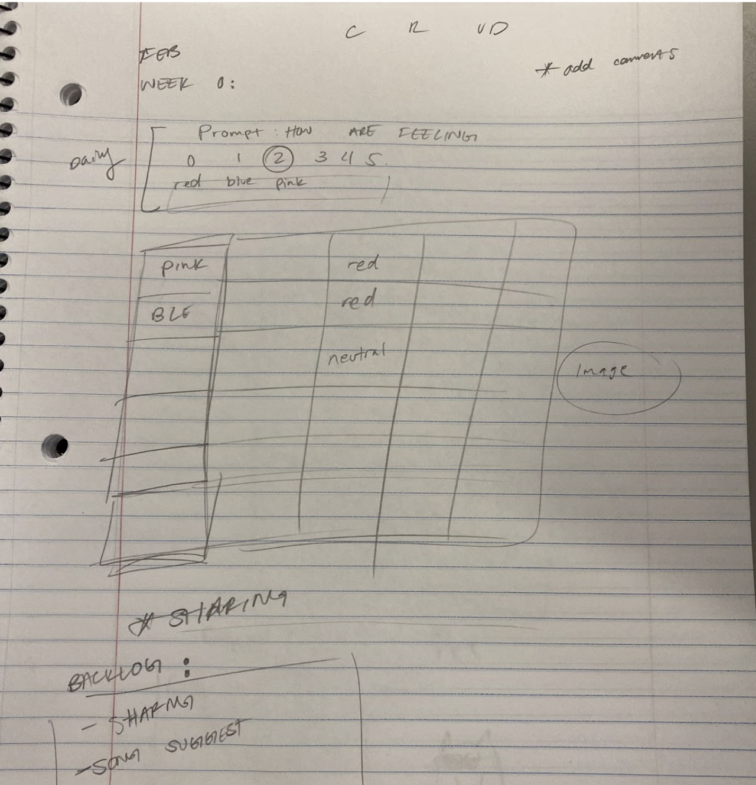

# Brainstorm Meeting Minutes
## Team #16: Githubbies
### Details 
- **10/17/22 12:30PM - 1:05PM**
- **Location: Geisel Library 1st Floor**

### Attendance: 
- [ ] Shubham Kumar (TA)
- [x] Gunwoo Kim (Lead)
- [x] Abishek Siva (Lead)
- [x] Maximillian Chen
- [x] Chun Hang Chan
- [x] Raymond Umbas
- [x] Shantelle Serafin
- [x] Jerry Wang
- [x] Xiangyi Lin
- [x] Tianyu Chen
- [x] Hung-I Huang

### Project Review:
Project Guidelines
- CRUD
- Local-first
- Information management
- HTML, CSS, Vanilla JS
- Use Github for everything

CRUD
- Create, Read, Update, Delete
- [What is CRUD?](https://www.crowdstrike.com/cybersecurity-101/observability/crud/#:~:text=CRUD%20is%20the%20acronym%20for,in%20relational%20and%20NoSQL%20databases)

### Idea Brainstorm 
Projects Problems Spaces (Problems & Target Users):
- Food
  - Problem: N/A
  - Users: human food consumers
- Exercise/Weight Lifting 
  - Problem: tracking workout progress
  - Users: those interested in lifting weights
- Human Habit
  - Problem: build/track habits 
  - Users: those interested in building habits
- Mood tracker 
  - Problem: check in with yourself 
  - Users: those interested in wellness, self-reflection, self-awareness 

App Ideas/Team Comments: 
- Mood Tracker
  - See “Mood Tracker Application Description” documents
- Journal Entries
  - Subjective, not just numbers
  - Feelings
- Meal Tracker
  - Take user data
  - How did you feel?
  - Calories - report too much or too less
  - Suggestion 
- Workout Tracker
  - Who you worked out with
  - Time you started
  - What you ate before you worked out
  - Exercises
    - Sets
    - Reps
  - Idea of combining journaling and workout tracker
  - How did you feel about the workout? (Scale from 1-10)
- Driving Tracker
  - Input the remaining miles before turning off the car (keep track of the average miles you drive every day/week/month/year)
  - Keep track of the gas prices every time you have to refuel
  - (Maybe:? Oil change, Maintenance etc)

