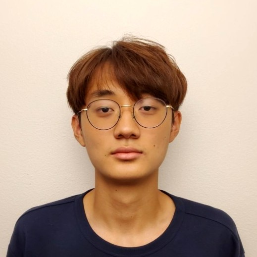
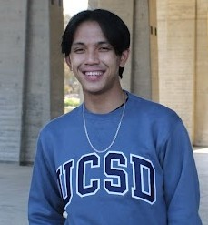
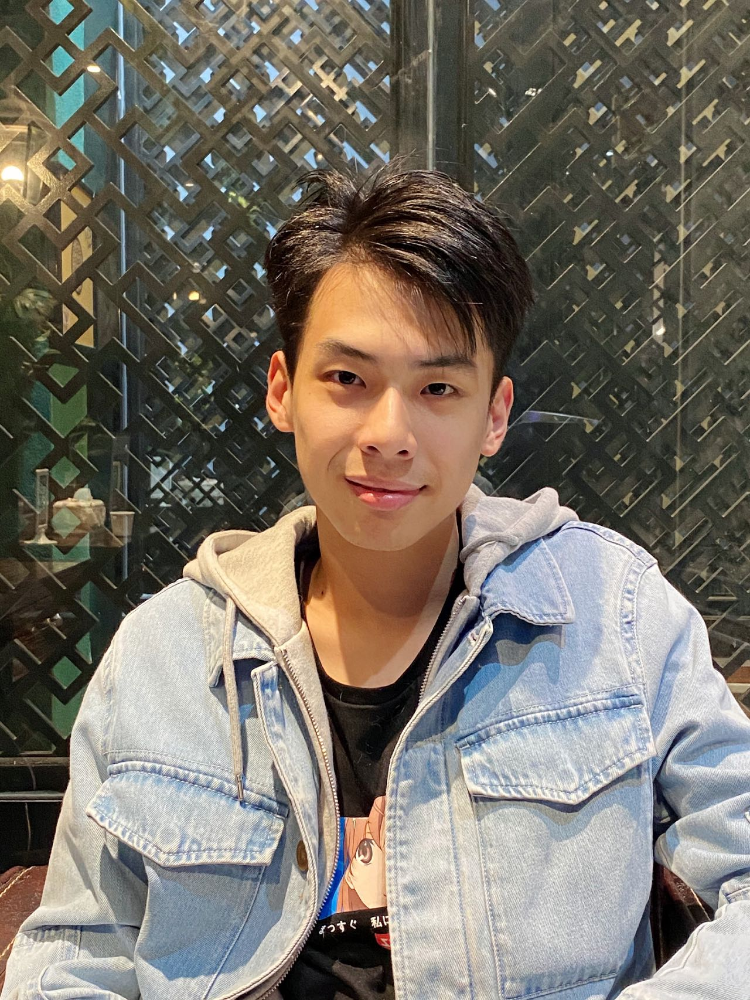
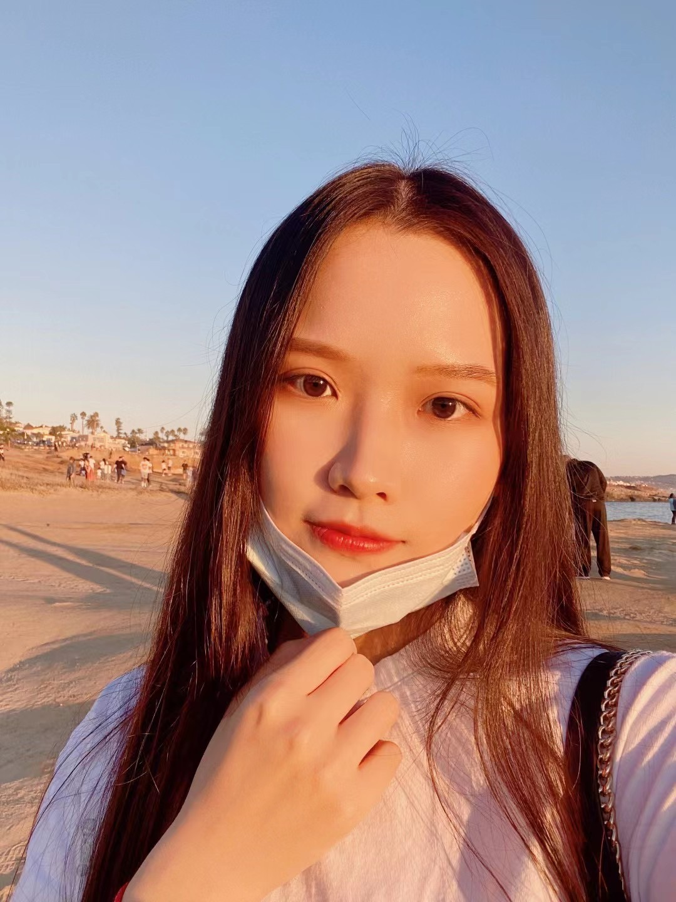
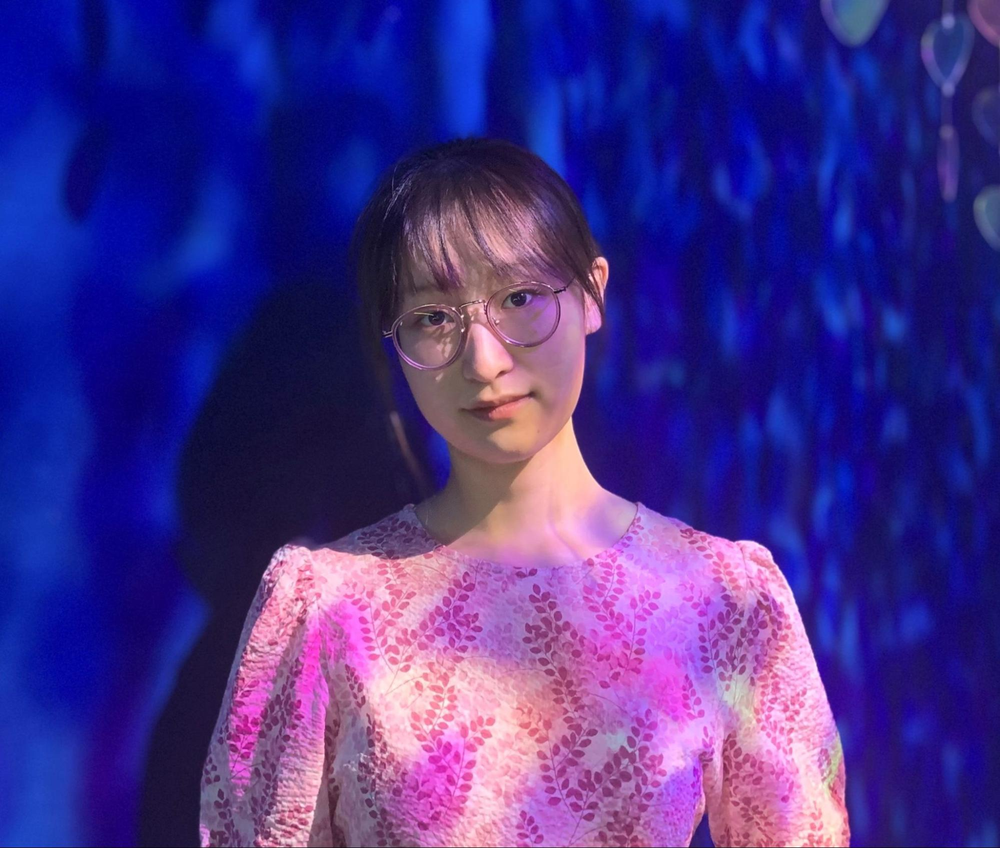
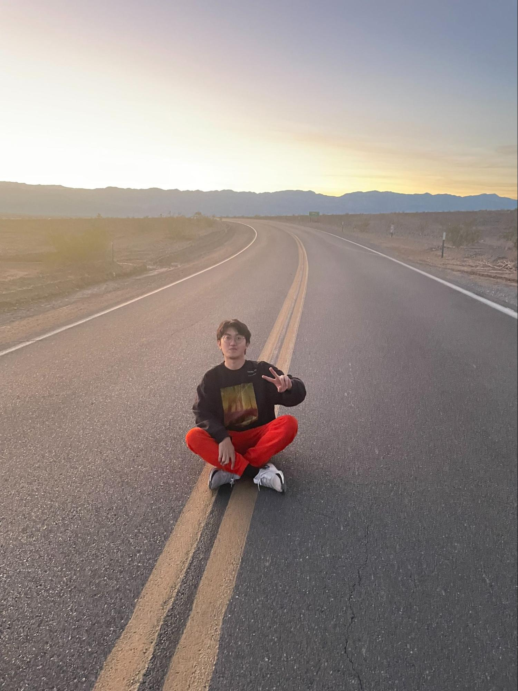

# Team Page
## Name: GitHuddies
## Team Mascot: Hubby

## Team Lead: Gunwoo Kim - [GitHub Profile](https://github.com/Ereasai)
 
Hello! I am a Math-Computer Science major in ERC. I would like to become a software engineer but not work at a big company. I have an interest in music, specifically late romantic music and composition. I am very excited to create something polished with a team which in my experience always went horribly wrong. Hopefully all the scope restrictions and support from TAs help us through.

## Team Lead: Abishek Siva - [GitHub Profile](https://github.com/abi2020)
 
Hi! I am a third year studying Mathematics and Computer Science in Seventh College. This previous summer, I interned at Northrop Grumman as a Software Engineering Intern. In my free time, I enjoy dancing on UCSD Zor, the Bollywood Fusion dance team on campus. 

## Maximillian Chen - [GitHub Profile](https://github.com/m4xch3n)
 
Hello! I am a 3rd year ICAM Music major and CSE Minor from Elenor Roosevelt college. I love making music and playing video games, as well as enjoying reading the occasional book. I think software engineering is a deeply human discipline, and cannot wait to work with my team to create something that might just make the world a better place.

## Chun Hang Chan - [GitHub Profile](https://github.com/hanghanghappy)
 
I am a 3rd year CS student at John Muir College. I like snowboarding and playing golf and I also enjoy going on roadtrips. I am interested in software engineering because of the satisfaction and feeling of success after completing projects.

## Raymond Umbas - [GitHub Profile](https://github.com/raymondumbas)
 
I am a 4th year CS major. For fun I like photography, getting boba with my girlfriend, and listening to music. I became interested in CS through playing video games.

## Shantelle Serafin - [GitHub Profile](https://github.com/shantellemeganserafin)
 
Hi! I’m a 4th year Cog Sci major. I have a strong interest in the intersection of technology and the arts/entertainment. This past summer, I interned in Atlanta, GA at BlackRock as a software engineer. I enjoy weight lifting, pilates, pageantry, and singing.

## Jerry Wang - [GitHub Profile](https://github.com/ZiyuWang0113)
 
I am a 4th year Math-CS student at Muir College. I am applying to graduate school right now, and I plan to do Computer Science or Data Science. I like computer games and photography. I like to watch Japanese Anime as well.

## Xiangyi Lin - [GitHub Profile](https://github.com/alina10050805)
 
I am a 4th year CS student at Earl Warren College. I like cooking and traveling. These things always bring me great satisfaction. I plan to become a software engineer after I graduate.

## Tianyu Chen - [GitHub Profile](https://github.com/tianyuchen01)
 
I am a 3rd year student majoring in Computer Science in ERC. I like singing, dancing, and taking pictures while traveling and I would love to learn more about photography. I’m currently learning web development.

## Hung-I Huang - [GitHub Profile](https://github.com/BenjaminnHuang)
 
I am a 4th year Math-CS student at ERC. I like to play instruments like guitar and piano, and I also like to sing as well. I recently try to make music when I have the free time. My programming interest is game design and I have been trying to learn it since I love playing vidoe games.

