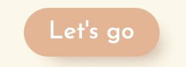
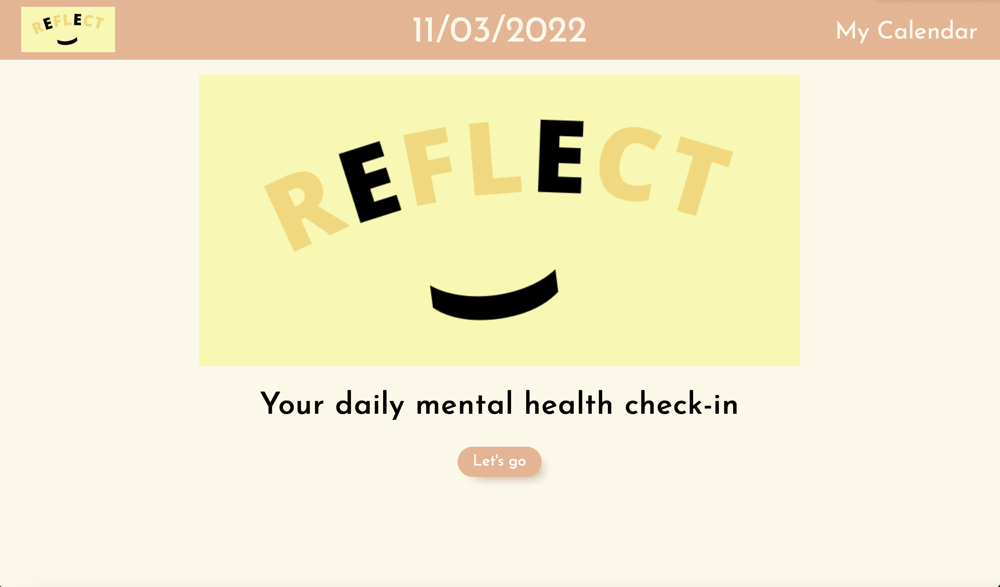
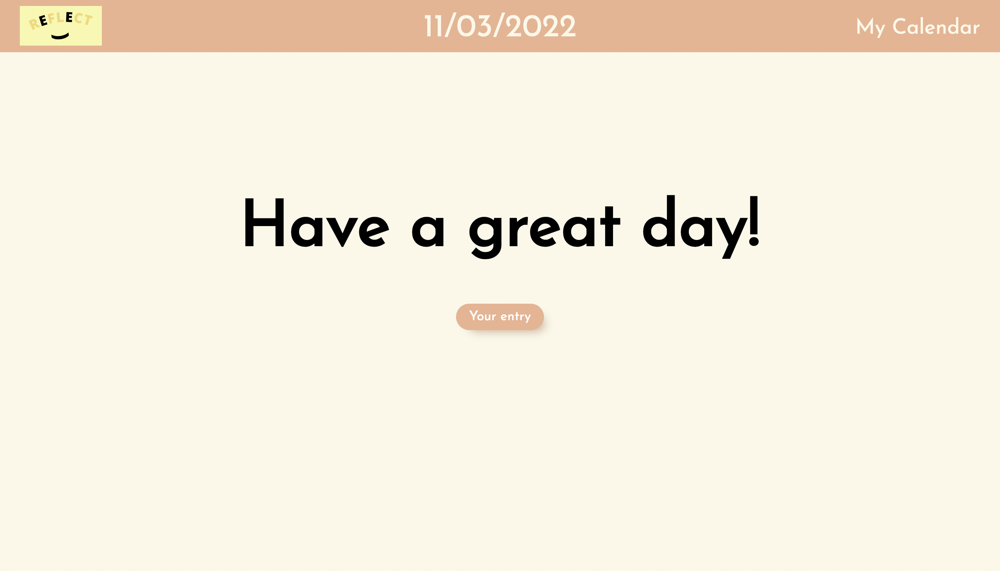

# Hello Page Group Meeting 11032022

### Page Link

Home page: https://cse110-fa22-group16.github.io/cse110-fa22-group16/source/hello-page/home-page.html

Finish page: https://cse110-fa22-group16.github.io/cse110-fa22-group16/source/hello-page/finish-page.html

### Time:

    2:00 pm - 6:00 pm

### Attendance:
- [x] Xiangyi Lin
- [x] Tianyu Chen
- [ ] Shantelle Serafin

### Include three pages:
- [x] home-page.html (first draft on 11/03/22)
- [ ] prompt-page.html
- [x] finish-page.html (first draft on 11/03/22)
- [ ] hello-style.css (first draft on 11/03/22)
- [ ] hello-event.js

### Note

* reflect Logo will be change to a transparent background next time.

* Each page should include navbar code.

* We already finish the navbar design and code. **Ask each group to include the navbar code in their html and css files.**
HTML (inside the body):
```
    <header>
        <a href=" "></a >
        <span class="date-today">11/03/2022</span>  <!-- TODO: get today's date on load -->
        <a href="" class="to-calendar">My Calendar</a >  <!-- TODO: href to calendar page -->
    </header>
```
CSS:
```
/* navbar */
body {
    background-color: #FCF8E8;
    margin: 100px 0 0 0;
}

header {
    background-color: #ECB390;
    position: fixed;
    top: 0;
    left: 0;
    right: 0;
    height: 80px;
    text-align: center;
}

header img {
    position: absolute;
    top: 10px;
    left: 30px;
    height: 60px;
}

header .date-today {
    display: inline-block;
    margin-left: auto;
    margin-right: auto;
    padding-top: 20px;
    font-size: 3rem;
    color: #FCF8E8;
}

header .to-calendar {
    position: absolute;
    top: 28px;
    right: 30px;
    font-size: 2rem;
}

header a {
    text-decoration: none;
    color: #FCF8E8;
}

header a:hover {
    color: #224B0C;
}
```

* We choose the font for the pages. **Ask each group to include the font link.**
Josefin Sans:
HTML(inside the head):
```
    <link rel="preconnect" href="https://fonts.googleapis.com">
    <link rel="preconnect" href="https://fonts.gstatic.com" crossorigin>
    <link href="https://fonts.googleapis.com/css2?family=Josefin+Sans&display=swap" rel="stylesheet">
```
CSS:
```
font-family: 'Josefin Sans', sans-serif;
```

* We design a button. Ask **edit-entry group** to include the style for the update button.

Button style:



Button hover style:


CSS:
```
/*button*/
button {
    display: block;
    margin-left: auto;
    margin-right: auto;

    font-size: 1.25rem;
    background: #ECB390;
    border-radius: 50px;
    box-shadow: #c49c83 10px 10px 15px -10px;
    color: #ffffff;
    
    padding: 10px 20px;
    border: 0;

    cursor: pointer;
}

button:hover {
    color: #224b0c;
    background: #e99b63;
}
```

## result

Home page:



Finish Page:


